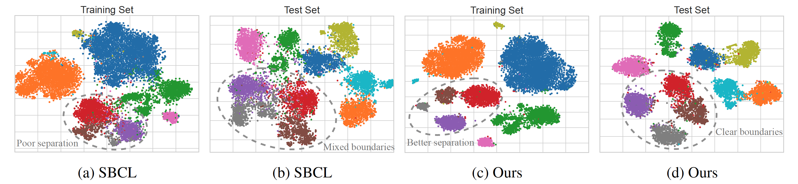

# Long-Tailed Recognition via Information-Preservable Two-Stage Learning

## Overview



The imbalance (or long-tail) is the nature of many real-world data distributions, which often induces the undesirable bias of deep classification models toward frequent classes, resulting in poor performance for tail classes. In this paper, we propose a novel two-stage learning approach to mitigate such a majority-biased tendency while preserving valuable information within datasets. Specifically, the first stage proposes a new representation learning technique from the information theory perspective. This approach is theoretically equivalent to minimizing intra-class distance, yielding an effective and well-separated feature space. The second stage develops a novel undersampling strategy that selects mathematically informative instances, able to rectify majority-biased decision boundaries without compromising a model’s overall performance. As a result, our approach achieves state-of-the-art performance across various long-tailed benchmark datasets, validated via extensive experiments.


## Requirements

Our model is based on the following libraries:

- torch == 1.13.0

- torchvision == 0.14.0

- tensorboard == 2.13.0

- timm == 0.5.4

- numpy == 1.26.0

- dppy == 0.3.3

  

You can use the following instructions to install all the requirements:

```python
# install requirements
pip install -r requirements.txt
```


## Evaluation

### Checkpoints

You can download the checkpoints directly and use the following commands to reproduce our results.

|   Datasets   |       Models       |                             Link                             |
| :----------: | :----------------: | :----------------------------------------------------------: |
| CIFAR-10-LT  |    BNS pretrain    | [checkpoint](https://drive.google.com/file/d/1H-rvEDOVSvuPsiazknfsBdZlXqUF45oa/view?usp=drive_link) |
| CIFAR-10-LT  | BNS linear probing | [checkpoint](https://drive.google.com/file/d/1ElMQ9uMcQPTZPsZK65eALyCDgMSOwP8Y/view?usp=drive_link) |
| CIFAR-10-LT  |  IP-DPP finetune   | [checkpoint](https://drive.google.com/file/d/1v2GQNBm2zVmM8PhzLkdM61S54X9BDCAr/view?usp=drive_link) |
| CIFAR-100-LT |    BNS pretrain    | [checkpoint](https://drive.google.com/file/d/1oFxJolourLz5mU99zNqfoJiUEc6cXSfw/view?usp=drive_link) |
| CIFAR-100-LT | BNS linear probing | [checkpoint](https://drive.google.com/file/d/1IHJ-sOgMU5_YNmphFoPSfBgIYdAcKoSJ/view?usp=drive_link) |
| CIFAR-100-LT |  IP-DPP finetune   | [checkpoint](https://drive.google.com/file/d/1vNBoTtVhBS4Q6dQ3NJe5d-CFwLsenXbx/view?usp=drive_link) |


### Evaluate BNS via Linear Probing Accuracy

Download the checkpoints and move them to the targeted directory. Then, you can evaluate the linear probing accuracy via the following commands:

- **CIFAR-10-LT**

```python
python main_cifar10_lineprob_bns.py \
  	--imbalanced_factor 100 \
  	--num_classes 10 \
  	--batch_size 64 \
  	--data_root '/mnt/data/cifar10' \
  	--eval 'output_dir/cifar10/lineprob_bns_cifar10/lineprob_bns_cifar10_if100.pth' 
```


- **CIFAR-100-LT**

```python
python main_cifar100_lineprob_bns.py \
	--imbalanced_factor 100 \
	--num_classes 100 \
	--batch_size 64 \
	--data_root '/mnt/data/cifar100' \
  	--eval './output_dir/cifar100/lineprob_bns_cifar100/lineprob_bns_cifar100_if100.pth'
```


### Evaluate IP-DPP via Various Metrics

Download the checkpoints and move them to the targeted directory. Then, you can evaluate the many-shot, medium-shot, few-shot, and overall accuracy via the following commands:

- **CIFAR-10-LT**

```python
python main_cifar10_finetune_ipdpp.py \
  	--imbalanced_factor 100 \
  	--num_classes 10 \
  	--batch_size 64 \
  	--data_root '/mnt/data/cifar10' \
  	--eval './output_dir/cifar10/finetune_ipdpp_cifar10/finetune_ipdpp_cifar10_if100.pth' 
```


- **CIFAR-100-LT**

```python
python main_cifar100_finetune_ipdpp.py \
	--imbalanced_factor 100 \
	--num_classes 100 \
	--batch_size 64 \
	--data_root '/mnt/data/cifar100' \
  	--eval './output_dir/cifar100/finetune_ipdpp_cifar100/finetune_ipdpp_cifar100_if100.pth'
```


## Two-Stage Learning for Long-Tailed Recognition

### Stage 1: Pretraining via Balanced Negative Sampling (BNS)

Use the following commands to pre-train the feature extractor from scratch:

- **CIFAR-10-LT**

```python
python main_cifar10_pretrain_bns.py \
	--epochs 1000 \
	--batch_size 1024 \
	--imbalanced_factor 10 \
	--num_classes 10 \
	--data_root '/mnt/data/cifar10' \
	--output_dir './output_dir/cifar10/pretrain_bns_cifar10' \
	--log_dir './output_dir/cifar10/pretrain_bns_cifar10'
```


- **CIFAR-100-LT**

```python
python main_cifar100_pretrain_bns.py \
	--epochs 1000 \
	--batch_size 512 \
	--imbalanced_factor 100 \
	--num_classes 100 \
	--data_root '/mnt/data/cifar100' \
	--output_dir './output_dir/cifar100/pretrain_bns_cifar100' \
	--log_dir './output_dir/cifar100/pretrain_bns_cifar100'
```


####  Evaluate BNS via Linear Probing 

Move the pre-trained feature extractor to the target directory and then evaluate it via linear probing accuracy:

- **CIFAR-10-LT**

```python
python main_cifar10_lineprob_bns.py \
	--epochs 100 \
	--batch_size 64 \
	--imbalanced_factor 100 \
	--num_classes 10 \
	--data_root '/mnt/data/cifar10' \
	--resume './output_dir/cifar10/pretrain_bns_cifar10/pretrain_bns_cifar10_if100.pth' \
	--output_dir './output_dir/cifar10/lineprob_bns_cifar10' \
	--log_dir './output_dir/cifar10/lineprob_bns_cifar10' 
```


- **CIFAR-100-LT**

```python
python main_cifar100_lineprob_bns.py \
	--epochs 100 \
	--batch_size 64 \
	--imbalanced_factor 100 \
	--num_classes 100 \
	--data_root '/mnt/data/cifar100' \
	--resume './output_dir/cifar100/pretrain_bns_cifar100/pretrain_bns_cifar100_if100.pth' \
	--output_dir './output_dir/cifar100/lineprob_bns_cifar100' \
	--log_dir './output_dir/cifar100/lineprob_bns_cifar100' 
```


### Stage 2: Finetuning via Information-Preservable Determinantal Point Process (IP-DPP)

Download the pre-trained feature extractors (or train them from scratch) and move them to the target directory. Then, we can finetune the classifier via IP-DPP by using the following commands:

- **CIFAR-10-LT**

```python
python main_cifar10_finetune_ipdpp.py \
	--epochs 100 \
	--batch_size 64 \
	--imbalanced_factor 100 \
	--num_classes 10 \
	--num_samples 500 \
	--data_root '/mnt/data/cifar10' \
	--resume './output_dir/cifar10/pretrain_bns_cifar10/pretrain_bns_cifar10_if100.pth' \
	--output_dir './output_dir/cifar10/finetune_ipdpp_cifar10' \
	--log_dir './output_dir/cifar10/finetune_ipdpp_cifar10' 
```


- **CIFAR-100-LT**

```python
python main_cifar100_finetune_ipdpp.py \
	--epochs 100 \
	--batch_size 64 \
	--imbalanced_factor 100 \
	--num_classes 100 \
	--num_samples 50 \
	--data_root '/mnt/data/cifar100' \
	--resume './output_dir/cifar100/pretrain_bns_cifar100/pretrain_bns_cifar100_if100.pth' \
	--output_dir './output_dir/cifar100/finetune_ipdpp_cifar100' \
	--log_dir './output_dir/cifar100/finetune_ipdpp_cifar100' 
```


## License

This repository is under Apache 2.0 license. Please refer to [LICENSE](./LICENSE.txt) file for details.


## Acknowledgment

This repository is based on the official implementation of [MAE](https://github.com/facebookresearch/mae). We thank the authors for releasing the code.
